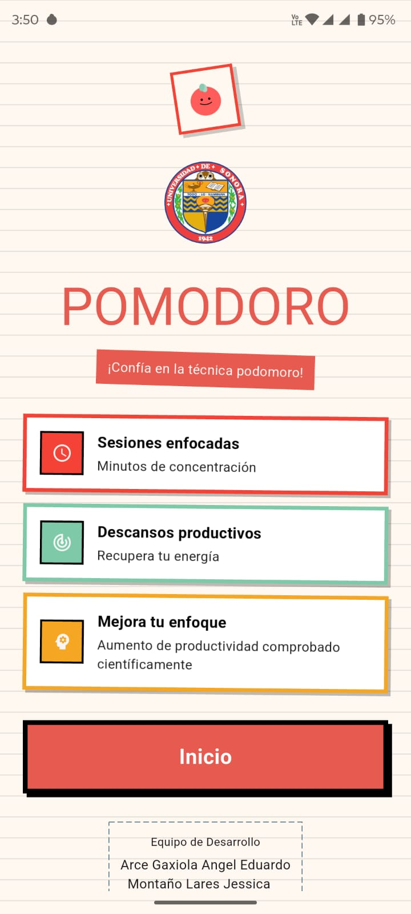
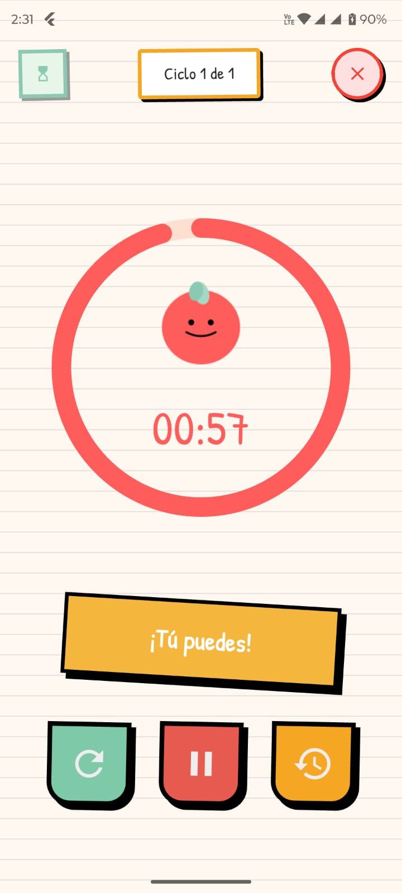
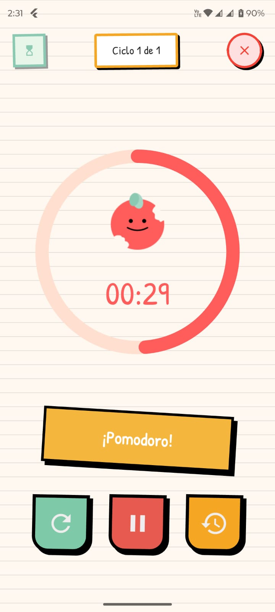
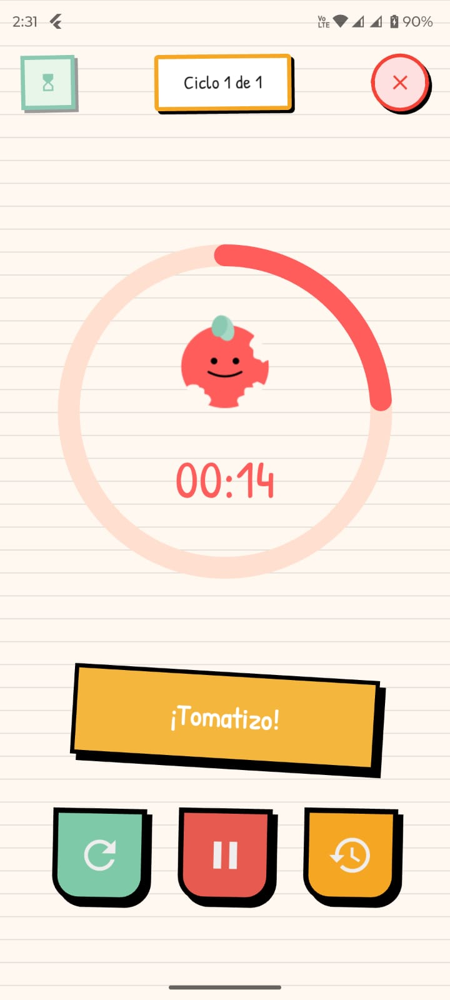
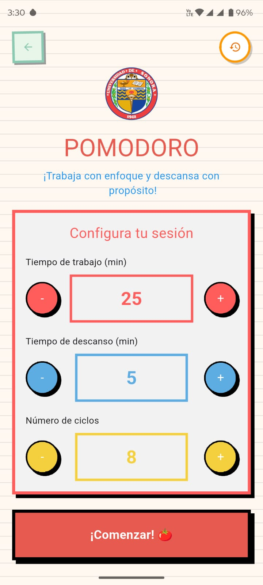
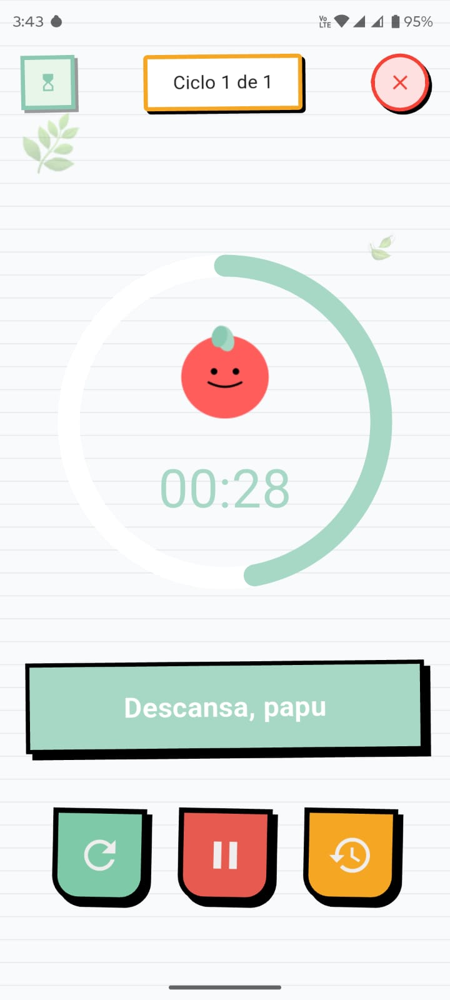
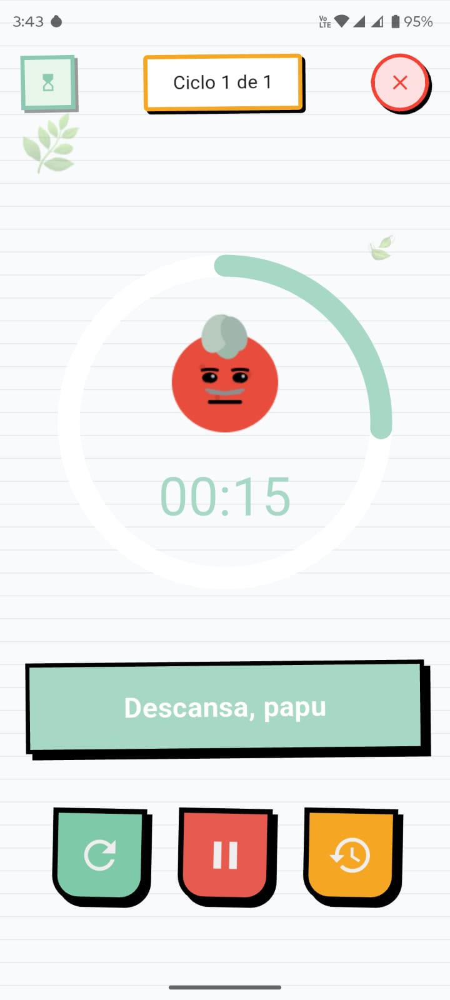
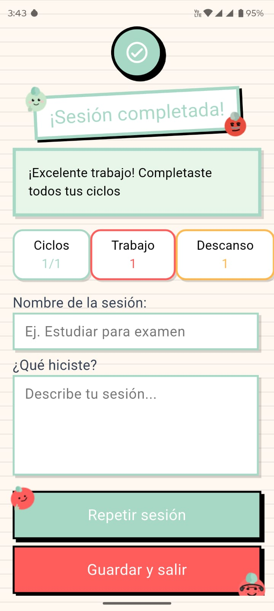
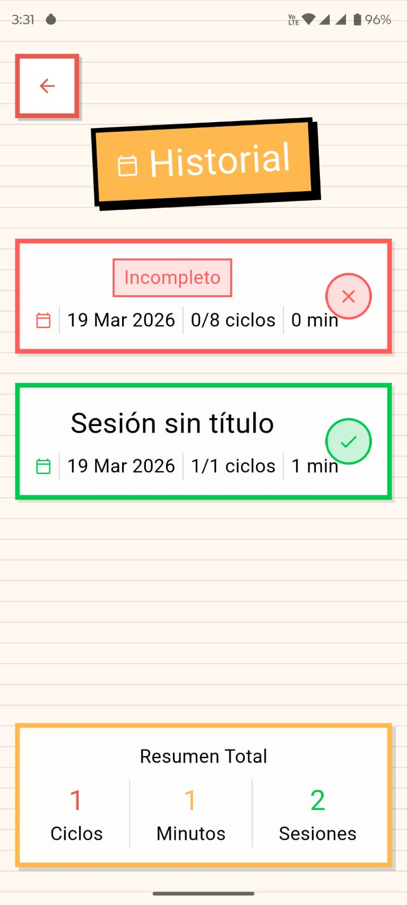

# pomodoro

Aplicación móvil desarrollada en Flutter que ayuda a los usuarios a mejorar su productividad mediante la técnica Pomodoro.

Caracteristicas:

- Temporizador Pomodoro
- Ciclos de Trabajo y descanso
- Controles de sesion
- Indicador visual de avance
- Historial de sesiones
- Resumen de productividad
- Notificaciones en segundo plano

Tecnologias:

- Flutter Flutter 3.41.0 • channel stable • https://github.com/flutter/flutter.git
- Tools • Dart 3.11.0 • DevTools 2.54.1

Dependencias utilizadas:

- Cupertino_icons 1.0.8
- flutter_launcher_icons 0.14.4
- Flutter Background_service
- Flutter_local_notifications

  

Imagenes:

  
  
  
  

  
  
  
  
  

